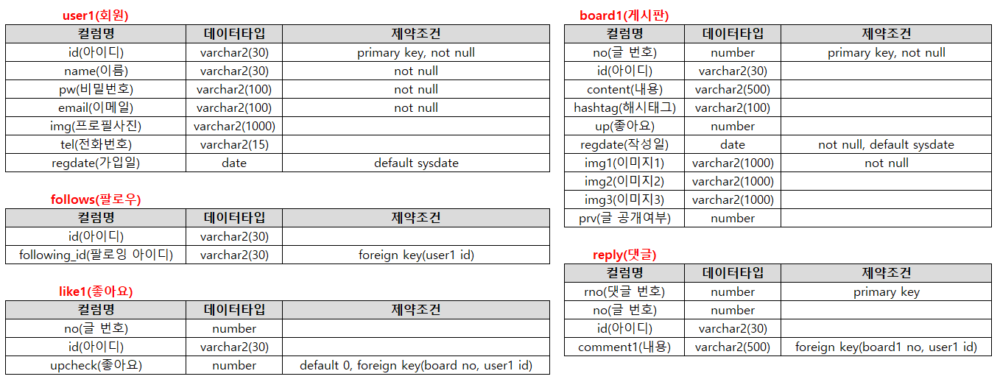
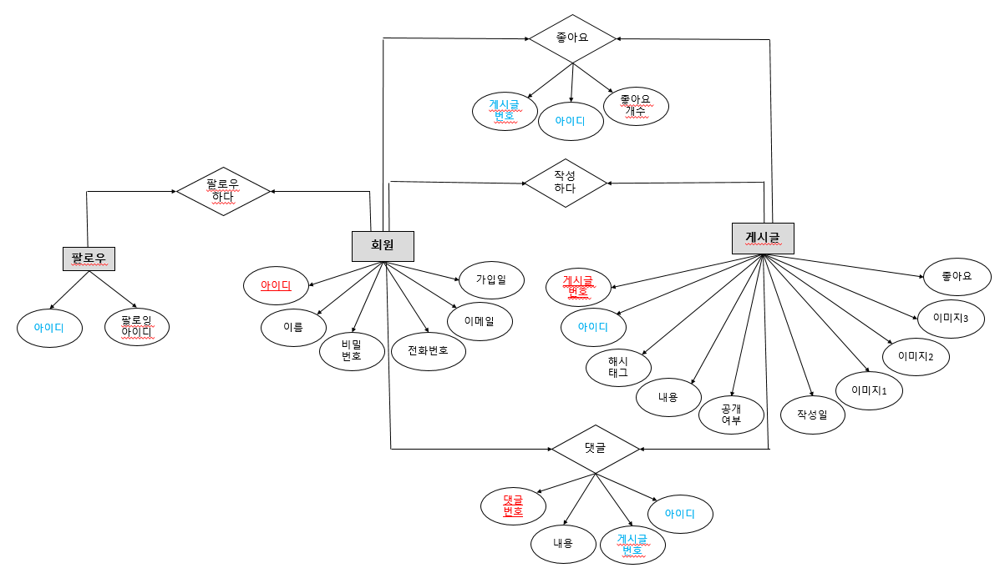
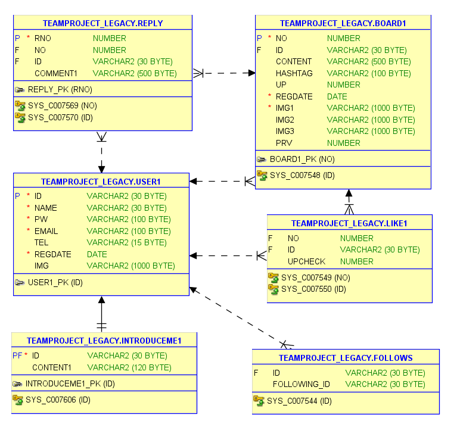
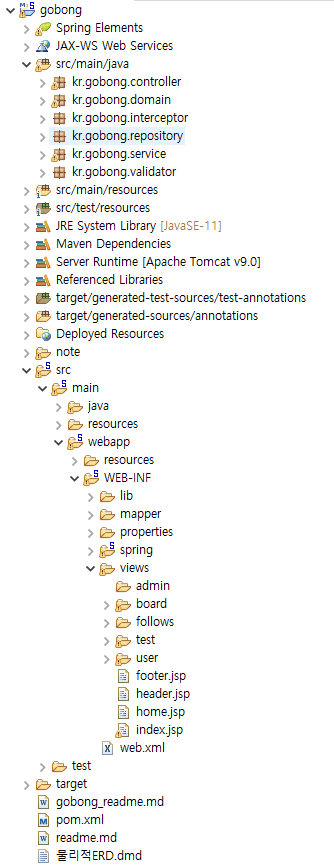
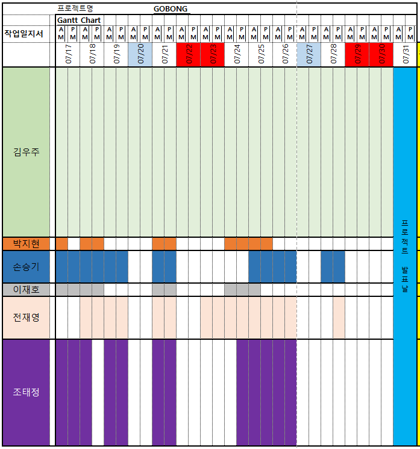
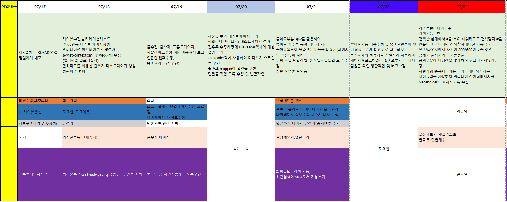
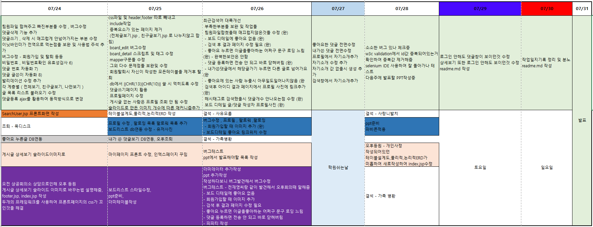

# 고봉프로젝트
# 프로젝트 개요
## 프로젝트 명 : Gobong (고양이가 따봉을 한다 라는의미)
## 프로젝트 기간 : 2023.07.10 ~ 07.25
## 프로젝트 참여  : 김우주 , 조태정
## JAVA ver : 11.0.18
## IDE(통합개발도구) : Spring Tool Suite 3.9.18
## JAVA script ver : 1.0
## Dynamic Web Module : 4.0
## DBMS : Oracle 11 xe + sqlDeveloper 21.2.1 + ANSI SQL Query
## Server : Apache Tomcat v9.0
## External Library : json, cos, commons ,lombok
## JAVA Script Plugin : JQuery 3.7.0
## Css FrameWork : bulma.io v0.9.4
## 프로젝트 데이터 처리패턴 : MVC2

---

# 프로젝트 주요 기능 및 특이사항
	- MVC2 패턴을 이용하여 구현하였고 DTO,DAO(interface),DAOImpl(인터페이스를 임플리먼츠한 class),
		Service(interface),ServiceImpl(위와동일),마이바티스를 이용하여 ~mapper.xml를 작성해
		db에 연동하여 값들을 CRUD하였습니다

## 비회원
	- 비회원은 전체 게시글, 게시글 상세보기 , 게시글 및 해시태그 검색기능만 사용이 가능합니다
	- 비회원은 회원가입과 로그인을 할 수 있습니다

## 로그인
	- 자바스크립트와 css를 이용하여 로그인 팝업창으로 처리하지않고
		자연스럽게 로그인창을 뜨도록 처리하여 form태그로 전송하여 로그인 하였습니다
	- 인터셉터 기능을 사용하여 유저가 로그인상태인지 아닌지 boolean상태로 표현하고
		그 값을 (loginUser) session스코프(root-context.xml사용)에 등록하도록 하였습니다

## 로그아웃
	- HttpServletRequest 를 사용하여 세션객체를 비우는 invalidate()를 사용하여 로그아웃 처리를 하였습니다

## 공통기능
### 검색기능
	- 자바스크립트로 구현하였습니다
	- appenChild와 remove()를 사용하여 페이지를 새로고침 할 필요 없이
		최근검색어 , 최근검색어 삭제에 대한 동적인 웹페이지를 구현하였습니다
	- 검색어는 db에 저장하지않고 세션영역에 저장하도록 하였습니다
	- 검색된 값을 #의 유무(%23) 를 판단하여 아이디를 검색할지 해쉬태그로 검색 할 지를 나누었습니다

## 회원 로그인을 한 후의 기능
### 게시글
	- 전체게시글 , 내가 팔로우를 한 친구의 게시글 , 글쓰기 등이 가능합니다
	- 글쓰기의 경우 공개상태를 선택 할 수 있습니다
	- 전체공개 게시글의 경우 모든 사람이 볼 수 있습니다
	- 친구공개 게시글의 경우 나를 팔로우 한 사람만 글을 볼 수 있습니다

### 따봉(좋아요) 기능 (상세보기 및 글목록)
	- 로그인을 하지않고 좋아요를 누르게 될 시 로그인창이 뜨게되며 로그인을 했을경우 좋아요를 누를 수 있습니다
	- ajax를 이용하여 비동기 처리를 하여 좋아요를 눌렀는지 안눌렀는지에 대한 유무(chk_sw)를 받아오고
		그 받아온 유무(chk_sw)를 통해 누르지 않은 게시글이라면
		해당 게시글의 좋아요 개수를 ajax를 통해 한번더 전송하고 좋아요 유무를 알수있는 
		테이블에 등록이 되도록 하였습니다
		좋아요가 테이블에 등록이 된 후 해당 게시글의 좋아요 개수를 나타내는 영역은
		부분적 새로고침을하여 동적 페이지를 구현하였고
		append기능을 이용하여 한번더 비동기 처리를 하여 이글을 좋아하는사람에 id가 나타나도록 하였습니다
	- 좋아요 유무를 받아왔을때 좋아요를 이미 누른 게시글 이라면
		해당 게시글의 좋아요를 취소할지에 대한 confirm팝업이 뜨게하였고
		취소를 할 시 마찬가지로 동적 페이지 처리로 좋아요 개수를 리로딩시키고
		비동기처리를 하여 해당 id값을 삭제하도록 하였습니다

### 따봉 누른 게시글
	- mybatis 를 이용하여 mapper.xml로 갖고왔으며 이중쿼리를 사용하여 땡겨왔습니다
	- 따봉누른 게시글들의 대표사진들 목록이 나오도록 구현했습니다

### 게시글 리스트에서의(전체게시글,친구게시글) 댓글
	- 로그인을 한 상태라면 댓글을 다는것에 제한이 없습니다
	- 댓글은 수정할수 없도록 해놨습니다(욕설 등으로 인한 다툼시 증거자료가 될수있기에 SNS에서는 댓글은 삭제만 하도록 되었다 들어서 그렇게 했습니다)
	- 리스트 에서의 댓글달기는 팝업창으로 떠서 팝업창에서 댓글을 달도록 구현해놨고
		댓글을 전송후 닫힐때 window.close()를 쓰면 form데이터가 전송 전에 팝업창이 닫혀
		ajax로 댓글내용을 전송 후 결과가 success가 됏다면 부모창(댓글창을 뜨게한 게시글페이지)를
		새로고침후 팝업창을 닫도록 하였습니다
	- 자바스크립트를 이용하여 요구 글자수가 넘어갈 경우 알림창이 뜨도록 하였습니다
	
### 게시글 상세보기에서의(전체게시글,친구게시글) 댓글
	- 로그인을 한 상태에서 상세보기 페이지로 들어가게되면
		댓글을 달수있는 창이 뜨게됩니다
	- ajax로 비동기 처리를하여 페이지의 이동이 없이 댓글을 전송한 후
		하단 댓글부분만 부분적으로 새로고침하게하여 실시간으로 쓴 댓글을 불러올 수 있도록
		동적페이지로 만들었습니다

### 내가 쓴 댓글
	- mybatis 를 이용하여 mapper.xml로 갖고왔으며 내가 댓글 단 글로 바로 갈 수 있도록 구현해놨습니다

### 글쓰기 기능
	- multipart/form-data를 사용하였고
		커스터마이징한 validation을 사용하여 properties에 있는 문구를 출력하도록 하였습니다
		해쉬태그가 없을시에 글 등록을 할수있지만 해쉬태그란에 무언가를 적었을때 #가 붙지않으면
		글쓰기가 통과못하도록 validation 처리를하였고
		대표사진을 등록하지 않을경우 글이써지지 않도록 처리했습니다
	- FileReader()객체를 이용하여 비동기적으로 파일의 값을 받아와 올릴 파일에 대해
		미리보기를 구현하였습니다

### 프로필 기능
	- 내가 올린 글들을 불러오도록 구현하였으며
		전체, 친구공개 게시글이 아닌 나만보기 게시글도 자신의 프로필에서는 볼 수 있도록 하였습니다

### 팔로잉 기능
	- 그사람의 친구공개 게시글을 보고싶을경우 팔로우를 하면
		팔로잉 한 사람의 친구공개 게시글을 볼 수 있도록 했습니다
	- 팔로우 목록
		나를 팔로우 하는사람과 내가 팔로잉을 하고있는사람의 목록을 볼 수있습니다
		자바스크립트로 새 창을 띄우지않고 볼수 있도록 구현하였습니다

### 자기소개 기능
	- id를 참조하는 테이블을 따로 만들었고
		전체글목록에서 댓글 등록을 하듯이 window.close()를 쓰면 데이터가 전송되기 전 팝업창이 닫히는점을
		고려하여 ajax를 이용해 데이터를 전송 후 success가 되면 자기소개 수정 페이지가 닫히도록 하였습니다
	- 자바스크립트를 이용하여 요구 글자수가 넘어갈 경우 알림창이 뜨도록 구현하였습니다
	
---

# 프로젝트 설계
## 테이블설계표

## 논리적ERD

## 물리적ERD

	
## 프로젝트구성도

---

# 작업일지 기록

---
---

#   김우주_작업목록

## 0717
	gobong project _ dev , db connect test
	프로젝트환경 설정 및 팀원에게배포

## 0718
	insert board , add User, validate, add login
	팀원들이 사용하기 쉽도록 테스트페이지를 몇 개 작성함
	유효성검사(발리데이션) 테스트페이지 추가
	멀티파일업로드의 루트를 설정하고 그에대한 테스트페이지 추가
	글쓰기 테스트페이지 추가
	글쓰기 ,글목록보기 ,회원가입 , 발리데이션기능추가 , 멀티파트(파일업로드) 추가및설정
	로그인기능 , 로그아웃기능

## 0719
	글수정, 글삭제, 프론트페이지, 각자잘한버그수정, 세션이용해서 로그인판단,
	좋아요기능 (반구현)

## 0720
	세션및 쿠키 테스트페이지 추가 - 전날 한 세션값이 이상하게 받아와지는거같아
	파일리더(미리보기) 테스트페이지 추가
	김우주 수정사항에 FileReader객체에 대한 설명 추가
	FileReader객체 사용하여 미리보기 스크립트 구현
	좋아요 mapper에 할것들 구현중
	팀원 파일 병합작업
	팀원들의 작업 오류수정

## 0721
	좋아요부분
	ajax를 활용하여
	동적 페이지 및 - 좋아요개수 , 비동기(페이지의 갱신없이)처리 - 좋아요목록에 올라오는 id들 
	팀원 파일 병합작업 및 작업파일들의 오류 수정

## 0722
	좋아요기능 대폭수정 및 좋아요만들때 썻던 ajax구문만 참고txt로 따로작성
	동적교체와 비동기를 적절하게 사용하여
	페이지새로고침없이 좋아요추가 및 삭제 
	팀원들 파일 병합작업

## 0723
	커스텀발리데이션추가
	검색창 한개에서 #을 붙여 해쉬태그로 검색할지 #을 안붙이고 아이디만 검색할지에대한 기능 추가
	뷰 브라우저에서 사진이 800*600이 아닐경우 강제로 늘려지게 나오는것을
	공백부분에 바탕색을 넣게하여 찌그러지지않게끔 수정
	회원가입 중복체크기능 추가 - 에이잭스사용
	제이쿼리를 사용하여 발리데이션 에러메세지를 placeholder로 표시하도록 수정

## 0724
	팀원파일 합쳐주고 빠진부분들 수정 , 버그수정
	댓글삭제 기능 추가
	댓글쓰기 , 삭제 시 매끄럽게 안넘어가지는 부분 수정
	이닛바인더가 전역으로 먹는점을 보완 및 사용법 주석 추가

###	자고일어나서 기능추가 해야할사항
	댓글 번호 자동화 , 댓글 글쓴이 자동화
	비밀번호 , 비밀번호확인 유효성검사
	유효성검사 문구 더 매끄럽게
	관리자페지이이고 아이디만 검색할지에대한 기능 추가

## 0724
	버그수정
	비밀번호 , 비밀번호확인 유효성검사 6)
	댓글 번호 자동화 7)
	댓글 글쓴이 자동화 8)
	발리데이션 수정 추가
	각 계층별 ( 전체보기, 친구글보기, 나만보기 ) 글 목록 리스트 불러오기 수정
	댓글등록 ajax를 활용하여 동적방식으로 변경

## 0725
	css파일 및 header,footer 따로 빼내고
	include작업
	중복요소가 있는 페이지 제거
	(전체글보기.jsp , 친구글보기.jsp 로 나누지않고 합침)
	board_edit 버그수정
	board_detail 스크립트 및 태그 수정
	mapper구문들 수정
	그외 다수 문제점들 보완및 수정
	회원탈퇴시 자신이 작성한 모든테이블을 제거후 탈퇴
	db에서 ||CHR(13)||CHR(10)|| 쓸 시 먹히도록 수정
	댓글쓰기페이지 활용
	프로필페이지 수정
	게시글 없는 사람은 프로필 조회 안 됨 수정
	슬라이드로 만든 이미지 개수에 따른 매커니즘추가

## 0726
	최근검색어 대폭개선 
	부족한부분들 보완 및 작업들
	팀원파일합쳤을때 매끄럽지않은것들 수정 (완)
	- 보드 디테일에 좋아요 없음 (완)
	- 회원가입할 때 이미지 추가 (완)
	- 검색 후 결과 페이지 수정 필요 (완)
	- 좋아요 누르면 이글을좋아하눈 어쩌구 문구 로딩 느림 (완) - 완벽한보안은 안함
	- 댓글 등록하면 전송 안 되고 바로 닫혀버림 (완)
	- 피피티 작성 
	- 내가쓴댓글에서 해당글가기 누르면 다른 글로 넘어가요(완
	- 좋아요에 있는 사람 누를시 아무일도일어나지않음 (완
	검색후 아이디 결과 페이지에서 프로필 사진에 링크추가 (완)
	해시태그로 검색했을시 댓글개수 안나오는점 수정 (완)
	보드 디테일 글/댓글 작성자 프로필사진 (완)

## 0727
	좋아요한 댓글 수정
	내가쓴 댓글 수정
	프로필에서 자기소개추가
	자기소개 수정 추가
	자기소개 값 없을시 생성 추가
	검색창에서 자기소개추가

# ppt에 적을 기능 설명 요약본

	게시글목록
	 -좋아요 수
	좋아요 수는 boardDTO에 있는것을 받아오도록 하였고
	좋아요를 누를 시 ajax를 이용하여 동적 웹페이지 처리를통해
	좋아요의 갯수 만 부분적으로 새로고쳐지도록 하였습니다
	
	 -좋아요한 사람 목록
	ajax를 이용하여 비동기식으로 새로고침을 하지않고
	좋아요 한 사람의 목록에 자기자신의 이름을
	추가혹은 제거를 하였습니다
	
	
	 -댓글 수
	마이바티스의 mapper를 이용하여 sqlSessionTemplate로
	DB와 연결해 오라클SQL에 등록한 board1 테이블을 리스트로 뽑아내어
	각각의 reply_cnt 컬럼을 갖고왔습니다
	
	게시글 상세보기
	 -댓글 작성 및 댓글 목록
	ajax를 이용하여 비동기 방식으로
	댓글을 등록하였고
	동적웹페이지 처리를 통하여
	container1라는 클래스를 지닌 (댓글목록) 영역만
	새로고침을 하도록 하였습니다
	
	
	 -이미지 슬라이드
	core태그를 사용하여 사진이 1개만 등록되었을시엔
	슬라이드 화살표를 나타나지 않게하였고
	등록된 사진의 개수에따라 
	css로 처리할 left의 값을 자바스크립트로
	상황에 따라 값을 다르게 하도록 설정해 주었습니다
	
	
	- 친구게시글
	board1테이블과 follows테이블을 만들어
	user1에서 만들어진 테이블에
	서로 follows테이블에 상호작용 하도록 등록된(친구등록) 유저라면
	board1에서 쓰여진 게시물이 친구 공개또는 전체 공개 일 경우
	친구의 게시글만 보여지도록 설정하였습니다
	
	
	- 내가 쓴 댓글
	댓글에 남겨놓은 id를 통해 내가 쓴 댓글이 무엇인지를
	select하여 해당 댓글의 내용 그리고 해당 게시글로 갈 수 있도록
	연결해놓았습니다
	
	
	- 따봉 누른 게시글
	따봉에 남겨놓은 id를 통해 내가 따봉을 누른 게시글이 무엇인지
	select하여 해당 게시글의 사진을 표시하도록 하였고
	그 게시글을 누를시 갈 수 있도록 연결해놓았습니다

## 0728
### 마무리작업중
	소소한 버그 있나 체크중
	w3c validation에서 id값 중복되어있는거 확인하여 중복값 제거해줌
	selenium IDE 사용하여 잘 돌아가나 테스트
	다음주에 발표할 PPT작성중

## 0729
	로그인 안해도 댓글창이 보이던것 수정
	상세보기 또한 로그인 안해도 보이던것 수정
	readme.md 작성

## 0730
	작업일지기록 작성
	readme.md 보완